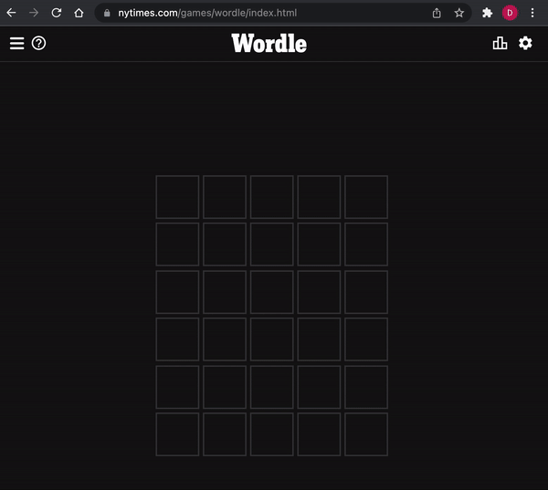

# wordlewiz

This is a browser extension for the [wordle](https://www.nytimes.com/games/wordle) game that recommends word choices to a user.



## How it works

As a first pass, the mechanics of this are fairly simple, but it's still a good exercise in uncovering constraints and exploiting them for profit. Plus, it was cool to see how much progress has been made in the PWA/service worker space, even if debugging is still a nightmare.

One of the most limiting constraints in wordle is the requirement that each choice be a valid 5-letter word in English. This drops the problem space from what would have been 11,881,376 (26^5) solutions down to about 5,000.

5k 5-letter words is almost nothing to store and process, so we can import one such [dictionary](./src/words.json) as a starting point.

Now, the ineteresting part is how we rank these word options. There are a few characteristics that make for a good word. The first is:

1. Its letters don't conflict with anything known about the solution (any info garnered from previous guesses)

Well, that's sensible, but it doesn't help us on the first guess.

2. Its letters are more likely to be present in the solution (yellow/green)

This gives us something to work with. Many people who play wordle know "RLSTNE" from wheel of fortune and use that as a basis for a guess, but the real order of letter frequency in English is more like "EARIOTNSL". But, this is considering **all** words in english. We don't need to consider all words -- only 5-letter words, so instead we can create a letter frequency map for each character (a-z) in every word in the dictionary.

Note, we don't double-weight words that contain the same letter more than once since on the first guess, providing 5 distinct letters is more productive. With this, we get a ranking like the following:

```json
[
  "arose",
  "aloes",
  "stoae",
  "arise",
  "raise",
  "earls",
  "laser",
  "reals",
  "aster",
  "rates",
  ...
]
```

This suggests that the letters "a", "r", "o", "s" and "e" are among the most common in the dictionary and thus will lend themselves to future guesses and/or the solution.

3. Its letters are more likely to be present in the solution _and_ in the correct position (green)

If we also add a weight to account for the positions of the letters, the rankings change quite a bit:

```json
[
  "tares",
  "cares",
  "dares",
  "pares",
  "bares",
  "tales",
  "mares",
  "hares",
  "fares",
  "nares",
  ...
]
```

This suggests that many words begin with the letter "t", many words have "a" as the second character, many words end in "s" etc.

For now, the global letter frequency and the positional letter frequency are weighed 50/50, but obivously these parameters can be tuned.

In theory, the ideal ranking could be found by running a simulation using every possible wordlist.

```go
bestWordlist := []
min := 5.0
for solution := range words {
    guessCount := 0
    for wordList := range getPermutations(words) {
        guessCount += runSimulation(solution, wordList) // returns #guesses to reach solution
    }
    avg := guessCount / len(wordList)
    if avg < min {
        bestWorldlist = wordList
        min = avg
    }
}
```

But this is cost prohibitive. I have no cluse what 5000! evaluates to, but it's way too big.

Instead, the weights of the global letter frequency and the positional letter frequency could be adjusted, and the resulting wordlists could be evaluated in a similar fashion.

Unfortunately, I don't feel like doing that, and it seems like the 50/50 weight does a decent job as-is.
